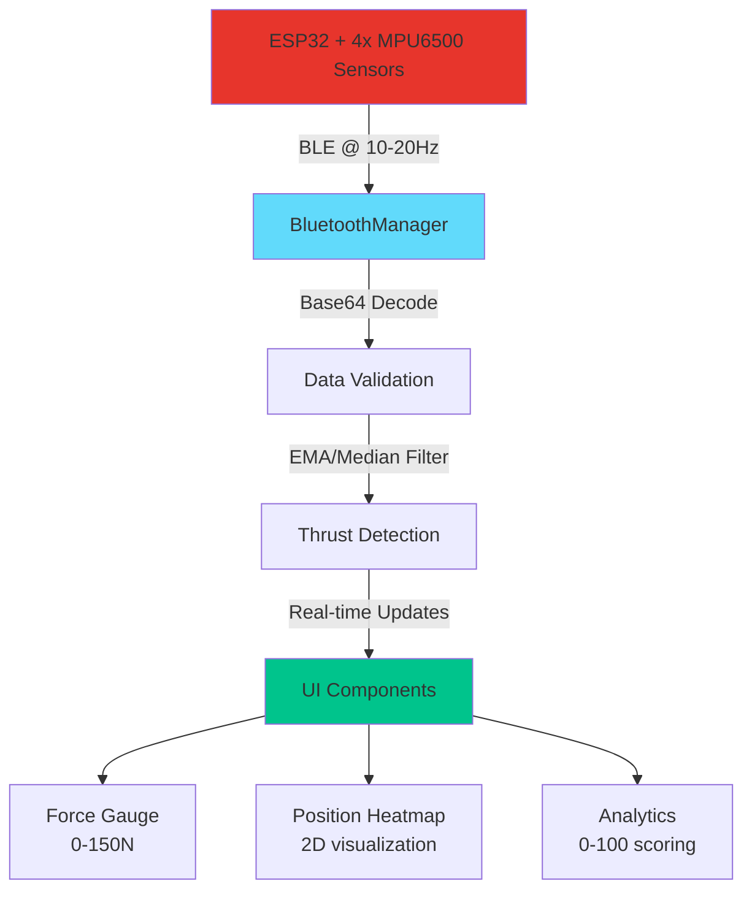

# RescueRight

### Smart Heimlich Training Vest | 🏆 Top 3 @ NUS IDEATE 2025 | 💰 S$10K Grant

<div align="center">

[](https://reactnative.dev/)
[](https://www.typescriptlang.org/)
[](https://expo.dev/)
[](https://www.espressif.com/)

**[📹 Demo Video](#) | [📚 Documentation](DeveloperDocs/) | [🚀 Quick Start](#quick-start)**

</div>

---

## 📋 Table of Contents
- [Overview](#overview)
- [Achievements](#achievements)
- [System Architecture](#system-architecture)
- [Technical Stack](#technical-stack)
- [Quick Start](#quick-start)
- [Performance](#performance)
- [Skills Demonstrated](#skills-demonstrated)

---

## Overview

Wearable IoT training system for Heimlich maneuver practice. ESP32 + 4x IMU sensors transmit real-time force, position, and angle data via BLE to a React Native app, delivering instant performance coaching with <200ms latency.

**Problem**: Heimlich training relies on subjective instructor observation—no quantitative feedback.

**Solution**: Data-driven training with objective metrics (±5N force accuracy, ±2cm position accuracy).

---

## 🏆 Achievements

<table>
<tr>
<td align="center"><b>🥉 Top 3</b><br/>NUS IDEATE 2025<br/><sub>100+ teams</sub></td>
<td align="center"><b>💰 S$10,000</b><br/>NUS VIP Grant<br/><sub>12-month funding</sub></td>
<td align="center"><b>🚀 Incubation</b><br/>BLOCK71 Singapore<br/><sub>The Hangar @ NUS</sub></td>
<td align="center"><b>👨‍💻 Solo Dev</b><br/>Entire Codebase<br/><sub>Full ownership</sub></td>
</tr>
</table>

**Timeline**: July 2025 - Nov 2025 | **Team**: 5-person interdisciplinary (1 software, 1 hardware, 1 mechanical, 2 business)

---

## 🎯 System Architecture


```mermaid
graph TB
    A[ESP32 + 4x MPU6500 Sensors] -->|BLE @ 10-20Hz| B[BluetoothManager]
    B -->|Base64 Decode| C[Data Validation]
    C -->|EMA/Median Filter| D[Thrust Detection]
    D -->|Real-time Updates| E[UI Components]

    E --> F[Force Gauge<br/>0-150N]
    E --> G[Position Heatmap<br/>2D visualization]
    E --> H[Analytics<br/>0-100 scoring]

    style A fill:#E7352C
    style B fill:#61DAFB
    style E fill:#00C48C
```

**Data Flow**: ESP32 Sensors → BLE (Base64) → Validation → EMA/Median Filtering → Thrust Detection (2.5N threshold, 400ms cooldown) → Real-time UI

---

## 💻 Technical Stack

<table>
<tr>
<td width="50%">

**Hardware**
- ESP32 DevKit V1
- 4x MPU6500 (6-axis IMU)
- Dual I2C @ 100kHz
- BLE 4.2 GATT

</td>
<td width="50%">

**Software**
- React Native 0.81 + TypeScript 5.9
- Expo SDK 54
- Three.js (3D visualization)
- AsyncStorage

</td>
</tr>
<tr>
<td>

**Processing**
- EMA filtering (α=0.2-0.3)
- Median filtering (window=5)
- Statistical validation (R², RMSE)

</td>
<td>

**Architecture**
- Singleton BLE manager
- Custom hooks (2)
- 6 screens, 41 components
- Modular design

</td>
</tr>
</table>

---

## 🚀 Quick Start

### Installation
```bash
git clone https://github.com/ZayK1/RescueRight.git
cd RescueRight/RescueRightApp
npm install && npm start
```

### Hardware Setup
```bash
# 1. Flash firmware to ESP32
# Open firmware/mvp2.ino in Arduino IDE → Upload

# 2. Wire 4x MPU6500 sensors
# Bus 1 (GPIO 21/22): MPU@0x68, MPU@0x69
# Bus 2 (GPIO 25/26): MPU@0x68, MPU@0x69

# 3. Verify sensors
# Serial Monitor (115200 baud) → Check 4 sensors detected

# 4. Pair with app
# Scan for "RescueRight Vest #001" → Connect
```

**Detailed setup**: [`DeveloperDocs/HARDWARE.md`](DeveloperDocs/HARDWARE.md)

---

## 📊 Performance

| Metric | Value | Target |
|--------|-------|--------|
| **BLE Update Rate** | 10-20Hz | ✓ |
| **Processing Latency** | <200ms | ✓ |
| **Force Accuracy** | ±5N | ±5N |
| **Position Accuracy** | ±2cm | ±5cm |
| **Angle Accuracy** | ±5° | ±5° |

---

## 🛠️ Skills Demonstrated

<table>
<tr>
<td width="50%">

**Full-Stack IoT**
- Hardware integration (ESP32, I2C, sensor fusion)
- Embedded firmware (C/C++, Arduino)
- Mobile development (React Native, TypeScript)
- BLE protocol (GATT services)

**Real-Time Systems**
- Signal processing (EMA/Median filtering)
- Data validation & quality assessment
- Sub-200ms latency optimization
- Efficient BLE subscriptions

</td>
<td width="50%">

**Software Engineering**
- Singleton pattern (BLE management)
- Custom React hooks
- TypeScript type safety
- Modular, testable architecture
- Clean separation (hardware, data, UI)

**Data Engineering**
- Sensor calibration methodology
- CSV analysis (Python visualization)
- Statistical validation (R², RMSE, MAE)
- Automated constant generation

</td>
</tr>
</table>

---

## 📁 Project Structure

```
RescueRight/
├── DeveloperDocs/          # Technical documentation (87KB)
│   ├── ARCHITECTURE.md     # System design & data flow
│   ├── HARDWARE.md         # ESP32 firmware & BLE protocol
│   ├── API_REFERENCE.md    # Modules, hooks, components
│   ├── DEPLOYMENT.md       # Build & deployment
│   └── CALIBRATION.md      # Sensor calibration
│
├── RescueRightApp/
│   ├── app/                # 6 screens (Expo Router)
│   ├── components/         # 41 components (training, analytics, connect)
│   ├── hooks/              # 2 custom hooks (BLE data, training state)
│   ├── lib/                # Core logic (bluetooth, calibration, session)
│   ├── firmware/           # 2 ESP32 programs (standard, optimized)
│   └── styles/             # Medical-grade design system
│
└── README.md
```

---

## 📚 Documentation

| Document | Description |
|----------|-------------|
| **[ARCHITECTURE.md](DeveloperDocs/ARCHITECTURE.md)** | System design, tech stack, data flow |
| **[HARDWARE.md](DeveloperDocs/HARDWARE.md)** | ESP32 firmware, sensors, BLE protocol, wiring |
| **[API_REFERENCE.md](DeveloperDocs/API_REFERENCE.md)** | Core modules, hooks, components, interfaces |
| **[DEPLOYMENT.md](DeveloperDocs/DEPLOYMENT.md)** | iOS/Android build & deployment |
| **[CALIBRATION.md](DeveloperDocs/CALIBRATION.md)** | Sensor calibration procedures |

---

## 💼 Development Context

**Role**: Sole software developer (entire codebase, firmware to mobile app)

**Duration**: 4 months (Oct 2024 - Jan 2025)

**Outcome**:
- 🥉 Top 3 finish (NUS IDEATE 2025, 100+ teams)
- 💰 S$10,000 NUS VIP grant (12-month funding)
- 🚀 BLOCK71 incubation (The Hangar @ NUS)
- 📱 Functional MVP deployed to iOS/Android
- 🔧 Production-ready codebase with full documentation

**Current Status**: Grant-funded, pursuing commercialization through BLOCK71.

---

## 📬 Contact

**Kasim Zayan**

Full-stack developer | IoT systems | Real-time data processing

Open to embedded systems, mobile development, and full-stack engineering roles.

---

<div align="center">

**Built with** ❤️ **for NUS IDEATE 2025**

*Last Updated: November 2025*

</div>
