# RescueRight: Smart Choking-Rescue Training System
## IDEATE 2025 Competition - Team 8 NUS

---

## 📋 Executive Summary

**RescueRight** is the world's first smart choking-rescue training vest with AI-powered coaching, developed by NUS IDEATE Team 8 for the IDEATE 2025 competition. Our innovative solution transforms traditional first aid training by embedding medical-grade sensors and real-time AI feedback into a wearable training vest, ensuring trainees learn precise, safe, and effective life-saving techniques.

### 🎯 Mission Statement
*"Transforming uncertain simulations into verified, life-saving skills"*

### 🏆 Competition Status
- ✅ **Successfully cleared PDR (Preliminary Design Review)**
- ✅ **Qualified for Semifinals** (October 15, 2025)
- 🎯 **Target**: Finals qualification with business pitch

---

## 👥 Team Members

| Name | Role | Expertise |
|------|------|-----------|
| **Ansh Bhaskar** | Market Analysis Lead | Business Strategy & Market Research |
| **Phua Kai Jie** | Pitch Lead | Communication & Presentation |
| **Kasim Zayan** | Product Differentiation Specialist | Competitive Analysis |
| **Serena Tang** | Technical Lead | Solution Architecture |
| **Daniel Yow** | Impact & Vision Lead | Strategic Planning |

---

## 🏛️ About IDEATE 2025

### Competition Overview

### Key Resources Provided

#### 💰 Financial Support
- **Budget**: $100 SGD per team for prototyping
- **Reimbursement Process**: IRL approval → LPI form → Receipts → Bank statements to Alvin Poh

#### 🏭 Facilities Access
- **Electronics Lab**: Prototyping workspace (Mon-Fri 8:30am-6pm)
- **Studios 1-4 @ E2A**: Additional workspaces
- **Innovation & Design Hub @ EA**: Consultation space

#### 🛠️ Equipment & Services

| Category | Details | Access Method |
|----------|---------|---------------|
| **Loanable Consumables** | Batteries, wires, tapes, resistors | Email Alvin + Appointment |
| **Loanable Non-consumables** | Motors, sensors, hot glue gun, calipers | Email Alvin + Appointment |
| **In-Lab Tools** | Multimeter, soldering iron, heat gun | Use in lab only |
| **3D Printing** | Max 256x256x256mm, ~3 days lead | Job Request Form |
| **Laser Cutting** | 2-5mm acrylic (clear/black/white) | Job Request Form |

#### 👨‍🏫 Mentorship Program
- **Industrial Mentors**: 2 hours consultation (e.g., Hugh Mason, Chan Tong Leong)
- **Student Mentors**: Technical and strategic guidance
- **Selection Deadline**: September 11, 2025 (Completed ✅)

### 📅 Critical Dates & Deadlines

| Date | Milestone | Status |
|------|-----------|--------|
| September 11, 2025 | Safety declaration & quiz | ✅ Completed |
| September 24 - October 7, 2025 | MVP Development Sprint | 🔄 In Progress |
| **October 7, 2025 (18:00)** | Semifinals poster submission (A1 PDF) | 📋 Pending |
| **October 14, 2025 (18:00)** | Finals slides submission | 📋 Pending |
| **October 15, 2025** | Semifinals presentation | 🎯 Target |

---

## 🚨 The Critical Problem

### The Choking Crisis by Numbers

### Key Statistics

| Metric | Value | Source |
|--------|-------|--------|
| **Global choking deaths** | Every 3 minutes | SJTREM 2025 |
| **Brain damage onset** | 4 minutes after airway blockage | Resuscitation Council UK |
| **Lifetime choking risk** | 1 in 3 people (33%) | Medical research |
| **Heimlich success rate** | Only 47% | Japan EMS study |
| **Singapore annual trainees** | >120,000 people | Singapore Heart Foundation/SCDF |
| **Skill retention decline** | Significant after 3-6 months | Training studies |

### The Training Gap

### Consequences of Poor Training

#### ⚠️ Too Little Force
- Airway remains blocked
- Victim continues choking
- Death or brain damage

#### ⚠️ Too Much Force
- Gastric ruptures
- Rib fractures
- Myocardial injury
- Internal organ damage
- Especially dangerous for elderly/vulnerable groups

---

## 🔍 Current Training Method Limitations

### Traditional Equipment Problems

| Issue | Description | Impact |
|-------|-------------|--------|
| **Subpar Equipment** | Static mannequins, basic vests | Minimal skill transfer |
| **No Force Measurement** | Cannot verify correct pressure | Risk of injury/ineffectiveness |
| **Inaccurate Assessment** | "Going through motions" | False confidence |
| **High Student Ratios** | Limited instructor feedback | Unequal training quality |
| **Practice Safety Concerns** | Can't practice full-force | Unprepared for real emergencies |

### Competitive Landscape Analysis

---

## 💡 The Solution: RescueRight Smart Vest System

### System Architecture

### 🎯 Core Features

#### 1. Precision Sensor Array

```mermaid
graph LR
    subgraph "Sensor Capabilities"
        A[Force Detection<br/>0-300N ±2N]
        B[Position Mapping<br/>1cm precision]
        C[Angle Analysis<br/>Thrust vectors]
        D[Depth Measurement<br/>Compression tracking]
        E[Rhythm Tracking<br/>Timing intervals]
    end
    
    style A fill:#afd,stroke:#333
    style B fill:#afd,stroke:#333
    style C fill:#afd,stroke:#333
    style D fill:#afd,stroke:#333
    style E fill:#afd,stroke:#333
```

**Technical Specifications:**
- **Sampling Rate**: 100Hz medical-grade pressure sensors
- **Force Range**: 0-300 Newtons with ±2N accuracy
- **Position Accuracy**: 1cm precision for hand placement
- **Real-time Processing**: Triangulation of force distribution
- **Calibration**: Automatic adjustment for different body types

#### 2. Real-Time AI Feedback System

##### Visual Guidance Components
| Feature | Description | Purpose |
|---------|-------------|---------|
| **Live Pressure Heatmap** | Color-coded force distribution | Instant visual feedback |
| **3D Hand Position Indicator** | Real-time hand placement tracking | Correct positioning |
| **Force Meter** | Green zone (80-120N optimal) | Safe force application |
| **Angle Indicator** | Thrust vector visualization | Proper technique |

##### Audio Coaching Features
- **Instant Corrections**: "Move hands 2cm higher"
- **Pressure Guidance**: "Increase pressure by 30%"
- **Rhythm Training**: "Thrust... release... thrust..."
- **Positive Reinforcement**: "Perfect pressure - maintain this"
- **Scenario Simulation**: Background noise, emergency timers

#### 3. Performance Analytics Dashboard

### 🔄 How It Works - Step by Step

---

## 📊 Market Analysis & Business Strategy

### Target Customer Segments

### Primary Customers
- **Singapore Red Cross Academy**
- **Singapore First Aid Training Centre (SFATC)**
- **Corporate training departments**
- **Healthcare institutions**
- **Educational facilities**

### Market Opportunity Analysis

#### 🌏 Market Size

| Market Level | Size | Details |
|--------------|------|---------|
| **TAM (Total Addressable Market)** | $4.5B → $7.5B by 2032 | Global first aid training market |
| **SAM (Serviceable Addressable Market)** | $750,000 | Singapore: 1,500 entities × 5 vests × $100 |
| **SOM (Serviceable Obtainable Market)** | $75,000 | 10% of SAM in Years 1-2 |
| **Singapore Annual Market** | $28 million | ~50,000 annual choke rescue learners |
| **ASEAN Expansion** | 20x opportunity | Regional scaling potential |

### Value Proposition Canvas

---

## 🏗️ Development Roadmap

### Current Phase: MVP Development Sprint
**September 24 - October 7, 2025**

### Semifinals Judging Criteria Alignment

| Criteria | RescueRight Response | Evidence |
|----------|---------------------|----------|
| **Product Demonstration** | Live vest demo with real-time feedback | Working MVP prototype |
| **Ergonomics & Usability** | Comfortable, adjustable vest design | User testing results |
| **Technical Design & Feasibility** | Medical-grade sensors, proven tech | Technical specifications |
| **Modularity & Scalability** | Modular sensor pods, cloud-ready | Architecture design |
| **Market Fit & Value Proposition** | Clear B2B model, validated need | Market research data |

---

## 🎤 Competition Pitch Strategy

### 4-Minute Pitch Structure

### Opening Hook (Kai Jie - 30 seconds)
> "Every 3 minutes, someone in the world dies from choking. And when the airway is blocked, you have just 4 minutes before brain damage begins. It's not rare — 1 in 3 people will experience a choking episode in their lifetime. But the way we train today doesn't prepare people to save lives tomorrow. Courses rely on static mannequins to teach, or even worse, simply ask participants to simulate doing the Heimlich maneuver. Assessments are just about going through the motions — there's no way to verify correct technique. Would someone trained in this manner really be confident to perform such maneuvers in the real world?"

### Closing Impact Statement (Daniel - 35 seconds)
> "With RescueRight: People learn the skill accurately with confidence; rescues will be more effective and safer—especially for vulnerable groups like the elderly. Every 3 minutes, someone dies from choking. RescueRight ensures that when someone is choking, rescuers can act confidently and safely. We're not just improving training. We're creating a smarter and safer standard for lifesaving."

---

## 🎯 Competitive Advantages

### Unique Differentiators

### Comparison Matrix

| Feature | RescueRight | Act+Fast Vest | CPR Mannequins | Suction Devices |
|---------|-------------|---------------|----------------|-----------------|
| **Force Measurement** | ✅ 0-300N ±2N | ❌ | ❌ | N/A |
| **Position Tracking** | ✅ 1cm precision | ❌ | ❌ | N/A |
| **Real-time Feedback** | ✅ AI-powered | ❌ | Limited | ❌ |
| **Data Analytics** | ✅ Comprehensive | ❌ | Basic | ❌ |
| **Certification** | ✅ Data-verified | ❌ | ❌ | N/A |
| **Scalability** | ✅ Cloud-ready | Limited | Limited | N/A |
| **Training Focus** | ✅ Choking rescue | ✅ | CPR only | Treatment only |

---

## 📈 Business Model

### Revenue Streams

### Go-to-Market Strategy

1. **Phase 1: Singapore Launch** (Months 1-6)
   - Partner with 3-5 training centers
   - Pilot programs with feedback loops
   - Refine based on user data

2. **Phase 2: Singapore Expansion** (Months 7-12)
   - Scale to 10% of market (150 entities)
   - Establish certification standards
   - Build brand recognition

3. **Phase 3: ASEAN Entry** (Year 2)
   - Regional partnerships
   - Localized content
   - 20x market opportunity

---

## 🌟 Expected Impact

### Quantifiable Outcomes

| Metric | Current State | With RescueRight | Improvement |
|--------|--------------|------------------|-------------|
| **Training Effectiveness** | 47% success rate | 75%+ projected | +60% improvement |
| **Skill Retention** | 3-6 month decline | 9-12 month retention | 2x better retention |
| **Injury Risk** | Unknown/High | Measured & minimized | Quantified safety |
| **Trainee Confidence** | Low | High (data-backed) | Verified competence |
| **Instructor Efficiency** | 1:20 ratio limited | 1:50+ with AI assist | 2.5x productivity |

### Social Impact

---

## 📞 Contact & Resources

### Team Communication
- **Email**: idp.studentsclub.ideate@u.nus.edu
- **Telegram**: https://t.me/ideate2025
- **Website**: www.ideate2025.com

### Key Contacts
- **Equipment & Budget**: Alvin Poh (alvinpoh@nus.edu.sg)
- **Electronics Lab Hours**: Mon-Fri 8:30am-6pm
- **Required Attire**: Covered shoes and long pants for lab access

### Important Documents
- ✅ Safety Declaration Form (Completed)
- ✅ Risk Assessment (Completed)
- ✅ Indemnity Form (Completed)
- ✅ Safety Quiz (Completed)
- 📋 Item Request List (IRL) - For budget approval
- 📋 List of Purchased Items (LPI) - For reimbursement
- 📋 Job Request Form - For 3D printing/laser cutting

---

## 🚀 Next Steps

### Immediate Actions (By October 7, 2025)
1. ✅ Complete sensor integration
2. ✅ Finalize MVP app development
3. ✅ Conduct user testing sessions
4. ✅ Design and submit A1 poster (18:00 deadline)
5. ✅ Prepare prototype demonstration

### Semifinals Preparation (October 7-15, 2025)
1. 📋 Refine pitch based on mentor feedback
2. 📋 Practice poster presentation
3. 📋 Prepare prototype demonstration
4. 📋 Anticipate judges' questions
5. 📋 Submit finals slides if advancing (Oct 14, 18:00)

### Success Metrics for Semifinals
- **Clear problem articulation** with compelling statistics
- **Live demonstration** of working prototype
- **Strong market validation** with local context
- **Differentiation clarity** vs existing solutions
- **Scalability vision** for ASEAN expansion

---

## 💭 Final Thoughts

RescueRight represents more than just a training tool—it's a paradigm shift in how we prepare people to save lives. By transforming "invisible" forces into measurable, teachable moments, we're not just improving training; we're setting a new standard for emergency response preparation.

Our journey from idea to prototype demonstrates the power of innovation when applied to critical human needs. With every sensor calibrated and every line of code written, we move closer to a world where no one dies from choking due to inadequate rescue attempts.

**Together, we're making every rescue right.**

---

*Document Version: 1.0 | Last Updated: September 28, 2025 | IDEATE 2025 Team 8*